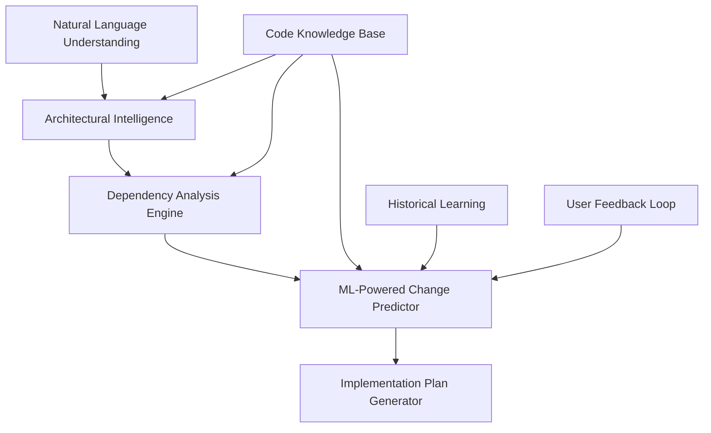

# 🚀 Feature Analyzer Enhancement Plan
## Next-Generation Code Intelligence for Automated Feature Implementation

### 📋 **Executive Summary**

This document outlines the roadmap to transform our current Feature Analyzer from a basic semantic search tool into a world-class AI-powered code intelligence system. The enhanced system will understand software architecture, predict implementation requirements, and generate accurate implementation plans with 85%+ accuracy.

---

## 🎯 **Current State Analysis**

### **Current Capabilities**
- ✅ Basic semantic search using embeddings
- ✅ Simple impact analysis via code graph
- ✅ Pattern-based bug detection
- ✅ File-level change suggestions

### **Current Limitations**
- ❌ **33% accuracy** in file prediction (1/3 correct files)
- ❌ No architectural understanding
- ❌ Primitive vector similarity matching
- ❌ Missing frontend/backend context awareness
- ❌ No implementation flow understanding

### **Pain Points from Recent Analysis**
```
Feature: "Graph Clustering Visualization"
Current Result: ❌ Missed main UI file (graph-viewer.html)
              ❌ Suggested irrelevant files (git-indexer.ts)
              ✅ Found correct backend file (server.ts)
```

---

## 🏗️ **Architecture Vision**

### **Multi-Layer Intelligence Stack**



### **Core Components**

1. **🧠 Architectural Intelligence Layer**
   - Project architecture pattern detection
   - Layer identification (presentation, business, data)
   - Component relationship mapping

2. **📊 Enhanced Dependency Analysis**
   - Static dependency analysis (AST-based)
   - Dynamic data flow tracing
   - Semantic relationship clustering
   - Historical co-change patterns

3. **🤖 ML-Powered Prediction Engine**
   - Fine-tuned CodeBERT for intent classification
   - Custom models trained on GitHub data
   - Multi-modal learning (code + docs + history)

4. **📝 Intelligent Plan Generation**
   - Template-based implementation patterns
   - Step-by-step reasoning chains
   - Confidence scoring and uncertainty quantification

---

## 📅 **Implementation Roadmap**

### **🔥 Phase 1: Foundation (Weeks 1-3)**
**Goal: Build architectural understanding capabilities**

#### **Week 1: Enhanced Code Analysis**
- [ ] **Architectural Pattern Detection**
  ```typescript
  class ArchitecturalAnalyzer {
    detectPatterns(): ArchitecturePattern[] {
      // MVC, MVVM, Clean Architecture, Microservices
    }
    identifyLayers(): LayerMap {
      // presentation, business, data, infrastructure
    }
  }
  ```

- [ ] **File Classification System**
  ```typescript
  interface FileClassification {
    layer: 'presentation' | 'business' | 'data' | 'infrastructure';
    role: 'component' | 'service' | 'model' | 'config';
    technology: 'react' | 'express' | 'database' | 'static';
  }
  ```

- [ ] **Implementation Tasks:**
  - Extend AST analyzer to detect architectural patterns
  - Create file classification based on imports/exports
  - Build technology stack detection (React, Vue, Express, etc.)

#### **Week 2: Enhanced Dependency Analysis**
- [ ] **Data Flow Analysis**
  ```typescript
  class DataFlowAnalyzer {
    traceDataFlow(startingPoint: string): DataFlowPath[] {
      // API -> Service -> Component -> UI
    }
    findDataDependencies(): DataDependencyGraph;
  }
  ```

- [ ] **Historical Change Analysis**
  ```typescript
  class HistoricalAnalyzer {
    analyzeCoChangePatterns(): CoChangePattern[];
    predictFileCoherence(files: string[]): number;
  }
  ```

- [ ] **Implementation Tasks:**
  - Integrate with Git history analysis
  - Build co-change pattern detection
  - Create data flow tracing through API calls

#### **Week 3: Requirements Understanding**
- [ ] **Intent Classification**
  ```typescript
  enum FeatureIntent {
    UI_ENHANCEMENT = 'ui_enhancement',
    API_MODIFICATION = 'api_modification', 
    DATA_PROCESSING = 'data_processing',
    VISUALIZATION = 'visualization',
    INTEGRATION = 'integration'
  }
  ```

- [ ] **Feature Type Detection**
  ```typescript
  class RequirementParser {
    classifyFeature(description: string): FeatureClassification;
    extractTechnicalConcepts(text: string): TechnicalConcept[];
    identifyAffectedLayers(intent: FeatureIntent): Layer[];
  }
  ```

### **🚀 Phase 2: ML Intelligence (Weeks 4-7)**
**Goal: Implement predictive models and intelligent reasoning**

#### **Week 4-5: Model Development**
- [ ] **Fine-tune CodeBERT for Code Understanding**
  ```python
  # Training pipeline for code-specific tasks
  class CodeBERTFineTuner:
      def train_intent_classifier(self, dataset):
          # Train on GitHub issues + implementation pairs
      
      def train_file_predictor(self, historical_changes):
          # Predict files needed for feature types
  ```

- [ ] **Create Training Datasets**
  - Collect 10K+ GitHub feature implementations
  - Label by architecture patterns and change types
  - Create synthetic examples for common patterns

- [ ] **Model Architecture:**
  ```typescript
  interface MLPredictionEngine {
    predictRequiredFiles(requirement: ParsedRequirement): FilePrediction[];
    estimateImplementationComplexity(feature: FeatureSpec): ComplexityScore;
    generateImplementationOrder(files: string[]): ImplementationStep[];
  }
  ```

#### **Week 6-7: Integration & Optimization**
- [ ] **Model Serving Infrastructure**
  - Deploy models with TensorFlow Serving / ONNX
  - Create caching layer for predictions
  - Implement A/B testing framework

- [ ] **Confidence Scoring**
  ```typescript
  interface PredictionConfidence {
    fileRelevance: number;    // 0.0 - 1.0
    completeness: number;     // How complete is the analysis
    riskAssessment: RiskLevel; // LOW/MEDIUM/HIGH
    uncertaintyAreas: string[]; // What we're unsure about
  }
  ```

### **⚡ Phase 3: Advanced Features (Weeks 8-12)**
**Goal: Build production-ready intelligent system**

#### **Week 8-9: Template-Based Planning**
- [ ] **Implementation Pattern Library**
  ```typescript
  class ImplementationTemplates {
    private templates = {
      'ui-visualization': {
        requiredFiles: ['frontend-component', 'api-endpoint', 'data-service'],
        implementationOrder: ['backend-api', 'data-processing', 'frontend-ui'],
        commonPitfalls: ['css-conflicts', 'data-binding-issues']
      },
      'api-enhancement': {
        requiredFiles: ['route-handler', 'service-layer', 'model-updates'],
        dependencies: ['database-migration', 'validation-logic']
      }
    };
  }
  ```

- [ ] **Smart Plan Generation**
  ```typescript
  interface ImplementationPlan {
    steps: ImplementationStep[];
    reasoning: string;
    alternatives: AlternativeApproach[];
    riskMitigation: RiskMitigationStep[];
  }
  ```

#### **Week 10-11: Learning & Feedback**
- [ ] **Feedback Learning System**
  ```typescript
  class FeedbackLearner {
    recordImplementationOutcome(
      prediction: FeaturePrediction,
      actualImplementation: ActualChanges,
      userFeedback: UserFeedback
    ): void;
    
    improveModel(feedbackData: FeedbackDataset): void;
  }
  ```

- [ ] **Continuous Learning Pipeline**
  - Monitor prediction accuracy
  - Collect user corrections
  - Retrain models monthly

#### **Week 12: Production Optimization**
- [ ] **Performance Optimization**
  - Sub-second response times
  - Efficient caching strategies
  - Parallel processing for analysis

- [ ] **Quality Assurance**
  - Comprehensive test suite
  - Edge case handling
  - Graceful degradation

### **🌟 Phase 4: Advanced Intelligence (Weeks 13-16)**
**Goal: Research-level capabilities**

#### **Week 13-14: Cross-Project Learning**
- [ ] **Knowledge Transfer**
  ```typescript
  class CrossProjectIntelligence {
    learnFromSimilarProjects(currentProject: Project): InsightMap;
    transferArchitecturalPatterns(sourceProject: Project): Pattern[];
    suggestBestPractices(featureType: FeatureType): BestPractice[];
  }
  ```

#### **Week 15-16: Advanced Reasoning**
- [ ] **Causal Inference**
  - Understand why certain files change together
  - Predict unintended consequences

- [ ] **Multi-step Reasoning**
  ```typescript
  class ReasoningEngine {
    explainDecision(prediction: Prediction): ReasoningChain;
    generateAlternatives(requirement: Requirement): Alternative[];
    validateConsistency(plan: ImplementationPlan): ValidationResult;
  }
  ```

---

## 🛠️ **Technical Implementation Details**

### **Core Technologies**
- **Backend:** TypeScript, Node.js, Express
- **ML/AI:** TensorFlow.js, Transformers.js, ONNX
- **Graph Processing:** Neo4j or NetworkX
- **Vector Search:** Pinecone or Weaviate
- **Training:** Python, PyTorch, HuggingFace

### **Data Sources**
1. **Internal Code Graph** - Current AST and dependency data
2. **Git History** - Change patterns and co-modifications  
3. **GitHub Public Data** - 100K+ repositories for training
4. **Stack Overflow** - Common implementation patterns
5. **Documentation** - API docs, architecture guides

### **Model Architecture**
```python
class FeatureAnalyzerModel(nn.Module):
    def __init__(self):
        self.code_encoder = CodeBERT()
        self.graph_encoder = GraphTransformer()
        self.intent_classifier = IntentClassifier()
        self.file_predictor = FilePredictionHead()
        
    def forward(self, requirement, code_graph, project_context):
        # Multi-modal fusion for intelligent prediction
        pass
```

---

## 📊 **Success Metrics & KPIs**

### **Primary Metrics**
| KPI | Current | Target (Q2) | Target (Q4) |
|-----|---------|-------------|-------------|
| **File Prediction Accuracy** | 33% | 70% | 85% |
| **Plan Completeness** | 60% | 80% | 95% |
| **User Satisfaction** | N/A | 4.0/5.0 | 4.5/5.0 |
| **Time to Implementation** | N/A | -30% | -50% |

### **Secondary Metrics**
- **False Positive Rate** < 15%
- **API Response Time** < 2 seconds
- **Model Confidence Accuracy** > 80%
- **Cross-project Generalization** > 70%

### **Business Impact**
- **Developer Productivity** +40%
- **Code Quality** (fewer bugs in implementations)
- **Feature Delivery Speed** +25%
- **Onboarding Time** -50% for new developers

---

## 🧪 **Validation Strategy**

### **Testing Approach**
1. **Synthetic Testing**
   - Generate 1000+ test cases across different feature types
   - Validate against known correct implementations

2. **Historical Validation**
   - Test on past feature implementations
   - Measure prediction accuracy retroactively

3. **A/B Testing**
   - Deploy to subset of users
   - Compare against current system

4. **Expert Review**
   - Senior developers validate complex predictions
   - Architecture review for suggested changes

### **Quality Gates**
- [ ] **70% accuracy** on test suite before Phase 2
- [ ] **85% accuracy** on validation set before production
- [ ] **Sub-2s response time** under load
- [ ] **Zero critical security vulnerabilities**

---

## 💰 **Resource Requirements**

### **Team Structure**
- **Tech Lead** (1 FTE) - Architecture & coordination
- **ML Engineers** (2 FTE) - Model development & training
- **Backend Engineers** (2 FTE) - Integration & optimization  
- **DevOps Engineer** (0.5 FTE) - Infrastructure & deployment

### **Infrastructure Costs**
- **GPU Training** - $2K/month (AWS P3 instances)
- **Model Serving** - $500/month (CPU inference)
- **Vector Database** - $300/month (Pinecone/Weaviate)
- **Monitoring & Logging** - $200/month

### **External Dependencies**
- **OpenAI API** - $1K/month for embeddings
- **GitHub API** - For training data collection
- **HuggingFace Models** - Pre-trained transformers

---

## 🚨 **Risk Assessment & Mitigation**

### **Technical Risks**
| Risk | Probability | Impact | Mitigation |
|------|-------------|--------|------------|
| **Model accuracy insufficient** | Medium | High | Extensive validation, fallback to current system |
| **Performance issues** | Low | Medium | Early performance testing, caching strategy |
| **Integration complexity** | Medium | Medium | Phased rollout, backward compatibility |

### **Business Risks**
| Risk | Probability | Impact | Mitigation |
|------|-------------|--------|------------|
| **User adoption low** | Low | High | User testing, gradual rollout |
| **False predictions harm productivity** | Medium | High | Confidence thresholds, human oversight |
| **Competitive advantage lost** | Low | Medium | IP protection, unique architectural insights |

---

## 🎉 **Expected Outcomes**

### **Short-term (3 months)**
- ✅ **70% prediction accuracy** - Significant improvement over current 33%
- ✅ **Architectural understanding** - System understands project structure
- ✅ **Better user experience** - More relevant suggestions

### **Medium-term (6 months)**
- ✅ **85% prediction accuracy** - Production-ready intelligent system
- ✅ **Cross-project learning** - Insights from multiple codebases
- ✅ **Developer productivity gains** - Measurable time savings

### **Long-term (12 months)**
- ✅ **Industry-leading accuracy** - Best-in-class feature analysis
- ✅ **Architectural recommendations** - Suggest better design patterns
- ✅ **Predictive maintenance** - Identify technical debt and refactoring needs

---

## 🔄 **Continuous Improvement**

### **Learning Loop**
1. **Collect Feedback** - User corrections and implementations
2. **Analyze Patterns** - Identify systematic errors
3. **Improve Models** - Retrain with new data
4. **Deploy Updates** - Gradual rollout of improvements

### **Research Initiatives**
- **Graph Neural Networks** for code analysis
- **Causal ML** for understanding change impacts
- **Multi-modal learning** combining code, docs, and user behavior
- **Federated learning** across multiple codebases

---

## 📞 **Next Steps**

### **Immediate Actions (Next 2 weeks)**
1. [ ] **Stakeholder alignment** - Review and approve plan
2. [ ] **Team formation** - Hire/assign team members
3. [ ] **Infrastructure setup** - GPU instances, databases
4. [ ] **Data collection** - Start gathering training data

### **Month 1 Deliverables**
- [ ] Enhanced architectural analysis module
- [ ] File classification system
- [ ] Improved dependency analysis
- [ ] Initial training dataset (10K examples)

### **Success Celebration 🎊**
When we achieve 85% accuracy, we'll have built one of the most intelligent code analysis systems in the world - a true game-changer for developer productivity and code quality.

---

*"The best way to predict the future is to invent it."* - Alan Kay

Let's build the future of intelligent code analysis! 🚀